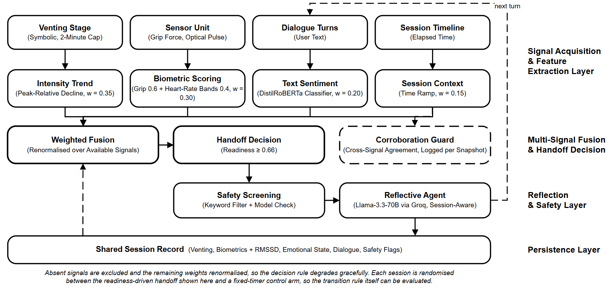

# CALMER

A two-module emotional-regulation web platform for students and young adults.

- **Module 1 — Rage Room:** a symbolic, time-limited venting game (smash a room, beat a ragdoll "buddy") that logs venting intensity rather than encouraging open-ended rage.
- **Module 2 — AI Companion:** an LLM reflective chat that helps the user process what came up.

The research contribution is a continuous, multi-signal **readiness score** that decides *when* to hand the user from venting to reflection — fusing venting-intensity trend, biometrics (heart rate + grip pressure), text sentiment, and session duration, and **renormalizing over whatever signals are present** so it degrades gracefully when hardware isn't attached.

> **Scope:** first-level, short-term support — **not** a replacement for professional therapy, and **not** a clinical-grade device. The classifier output is treated as a noisy text-sentiment signal, not ground-truth "emotion."

## Architecture



| Layer | What it does |
|---|---|
| **Unified schema** (`scripts/003`) | `session` is the hub; `emotional_state` is the pivot (readiness snapshots); `venting_interaction` (Module 1), `therapist_convo` (Module 2), `biometric_reading` + `hardware_device` (hardware), `safety_flag` (crisis). |
| **Readiness fusion** (`lib/calmer/readiness.ts`) | `computeReadinessScore` weight-fuses available signals and renormalizes; `classifyBiometrics` maps HR/pressure to a stress score; `corroborateBiometricTransition` evaluates whether a biometric-only decline is corroborated by a non-biometric signal and records the verdict per snapshot. |
| **Face (opt-in)** (`components/calmer/face-tracker.tsx`) | Webcam expression via `@vladmandic/face-api`, on-device, off by default, models in `public/models/face`. Mapped to the same valence scale as text sentiment (`lib/calmer/affect-valence.ts`); a noisy signal, not ground-truth emotion. Never part of the evaluated four-signal rule. |
| **Voice (opt-in)** (`components/calmer/voice-tracker.tsx`) | Microphone vocal effort (loudness above the noise floor; no speech recognition, nothing recorded), off by default. Scored by the same decline-from-session-peak rule as venting (`lib/calmer/vocal-arousal.ts`). Never part of the evaluated four-signal rule. |
| **Gestures (opt-in)** (`components/calmer/gesture-controller.tsx`) | Smash the rage room with your hand: MediaPipe gesture recognition, palm aims, fist smashes, open hand stops (`lib/calmer/gesture-input.ts`). A new input device on the same path as the mouse, so venting telemetry is unchanged. Runtime + model load from CDNs (needs internet). |
| **Sentiment** (`lib/calmer/emotion-classifier.ts`) | j-hartmann emotion classifier via the HF Inference router; loud lexicon-stub fallback (never silent). |
| **Safety** (`lib/calmer/safety.ts`) | Layered crisis detection: lexical pre-filter + LLM risk check, combined conservatively; safety-mode reply and a persisted `safety_flag`. |
| **Cross-module fusion** | One `session` spans venting **and** chat: the rage room's `session_id` is carried into `/chat?session=...`, so chat readiness fuses venting history with text sentiment. |
| **Hardware** (`hardware/`) | Arduino (pulse + FSR) → `serial-bridge.js` → `/api/biometric`. Inter-beat intervals become a rolling RMSSD. |

## Tech stack

Next.js 16 (App Router) · React 19 · TypeScript (strict) · Tailwind + shadcn/ui · Supabase (Postgres + Auth + RLS) · Vercel AI SDK v6 · open-weight gpt-oss-120b via **Groq** (OpenAI-compatible API; Groq retired its Llama chat models in 2026) · j-hartmann classifier via the Hugging Face Inference router · Vitest · ESLint (eslint-config-next).

## Prerequisites

- Node.js 20+ (developed on 24)
- A Supabase project
- A **Groq** API key (the chat model)
- A **Hugging Face** token (the sentiment classifier only)

## Setup

1. **Install** (the React 19 ecosystem needs legacy peer resolution):
   ```bash
   npm install --legacy-peer-deps
   ```

2. **Environment** — copy the template and fill in real values:
   ```bash
   cp .env.example .env.local
   ```
   `.env.local` is gitignored — never commit real keys, especially `SUPABASE_SERVICE_ROLE_KEY`. Do **not** leave placeholder duplicates in the file; dotenv keeps the last value.

3. **Database** — run all fourteen migrations **in numeric order** in the Supabase SQL editor:
   ```
   001_create_calmer_tables.sql          # original tables
   002_upgrade_calmer_schema.sql         # user_memories + mood logs
   003_calmer_unified_schema.sql         # unified entity model (the paper's schema)
   004_add_signals_used.sql              # signals_used / using_stub_signals
   005_drop_game_sessions.sql            # retire legacy game table
   006_session_chat_metadata.sql         # title / summary / mood on session
   007_drop_legacy_chat_tables.sql       # retire legacy chat + mood tables
   008_biometric_hrv.sql                 # ibi + rolling rmssd
   009_session_mrt_condition.sql         # micro-randomised trial assignment
   010_emotional_state_corroborated.sql  # biometric corroboration outcome
   011_venting_idle_input_type.sql       # persist idle ticks (shared venting history)
   012_drop_session_current_state_view.sql  # SECURITY: drop a view that bypassed RLS
   013_study_integrity.sql               # DB-drawn trial arm, offer log, sensor rows via the API only
   014_trusted_supporter.sql             # trusted person: aggregates-only view, user-sent alerts
   ```
   Then confirm RLS: as user A you must not be able to read user B's `session` rows.

4. **Hardware (optional)** — `hardware/` needs its own env file:
   ```bash
   cp hardware/.env.example hardware/.env
   ```
   `CALMER_HARDWARE_SECRET` there **must match** `HARDWARE_INGEST_SECRET` in `.env.local`, or the bridge and simulator get a 401. You can exercise the whole sensing path with no board attached. Run it from inside `hardware/`, which is where it reads `hardware/.env` from:
   ```bash
   cd hardware && npm install && node simulate.js --session <SESSION_UUID>
   ```
   See `hardware/TESTING.md` for the real-board procedure.

## Running

```bash
npm run dev
```
Walk the flow: sign up → rage room → **Find Peace** → chat → dashboard. Watch both the browser console and the `next dev` terminal — DB write failures log via `console.error` rather than throwing.

## Scripts

| Script | Purpose |
|---|---|
| `npm run dev` | Dev server |
| `npm run build` | Production build |
| `npm start` | Serve the production build |
| `npm run typecheck` | `tsc --noEmit` (strict) |
| `npm run lint` | ESLint |
| `npm test` | Vitest (unit) |
| `npm run test:watch` | Vitest watch mode |

## Testing

The unit tests cover the pure logic the research claim rests on — score bounds, weight renormalization over any subset of signals, the session-peak venting trend, honest reporting of which signals contributed, biometric classification bands, RMSSD, the layered safety combination, the biometric corroboration rule, the sustained-calm handoff rule, the per-signal contribution breakdown, chat-history sanitising, the trusted-supporter digest and safe auth redirects. No DB or network required. Add tests alongside the code as `*.test.ts`.

## Research scripts

Read-only analyses over the live database (Node 23.6+, `.env.local` with the
service-role key; outputs are gitignored). Run with `node --no-warnings scripts/<name>.mjs`.

| Script | What it answers |
|---|---|
| `weight-sensitivity.mjs` (+ `plot-weight-sensitivity.py`) | Do the readiness weights' *order* or *magnitudes* decide the handoff? Replays every stored decision. |
| `safety-eval.mjs` | How well does the layered crisis detector do on a labelled set (`safety-eval-set.json`)? |
| `biometric-quality.mjs` | What do the heart-rate plausibility gate and HRV artifact rejection change on the stored readings? |
| `mrt-analysis.mjs` (`--power` for the sample-size simulation) | The micro-randomised trial analysis — readiness rule vs fixed timer. Protocol drafted separately. |

## CI

`.github/workflows/ci.yml` runs typecheck → lint → test → build on every push/PR to `main`. The build step uses throwaway Supabase env values (no secrets in CI).

`.github/workflows/keep-alive.yml` queries Supabase twice a week so the free-tier project never pauses (it did on 2026-10-01). Add the `NEXT_PUBLIC_SUPABASE_URL` and `NEXT_PUBLIC_SUPABASE_ANON_KEY` repository secrets once; if the project is already paused the job fails and GitHub emails you.

## Deployment (Vercel)

Import the GitHub repo into Vercel and set the environment variables from `.env.example` in the project settings (`SUPABASE_SERVICE_ROLE_KEY` server-only). Next.js is auto-detected; no extra config needed. Pushes to `main` redeploy only if the Vercel project is connected to the repo; migrations, environment variables and Supabase auth settings are never deployed by a push. See [docs/DEPLOYMENT.md](docs/DEPLOYMENT.md) for ownership, Supabase settings, free-tier limits and a post-deploy smoke test.

## Project structure

```
app/            App Router pages + API routes (chat, biometric, sessions, …)
components/     game/ (rage room), chat/, dashboard/, analytics/, ui/ (shadcn)
lib/calmer/     readiness fusion + emotion classifier (the research core)
lib/supabase/   client / server / service-role clients
lib/services/   memory, analytics, session helpers
scripts/        SQL migrations (run 001 → 014 in order) + research scripts
hardware/       Arduino sketch + serial bridge
```
